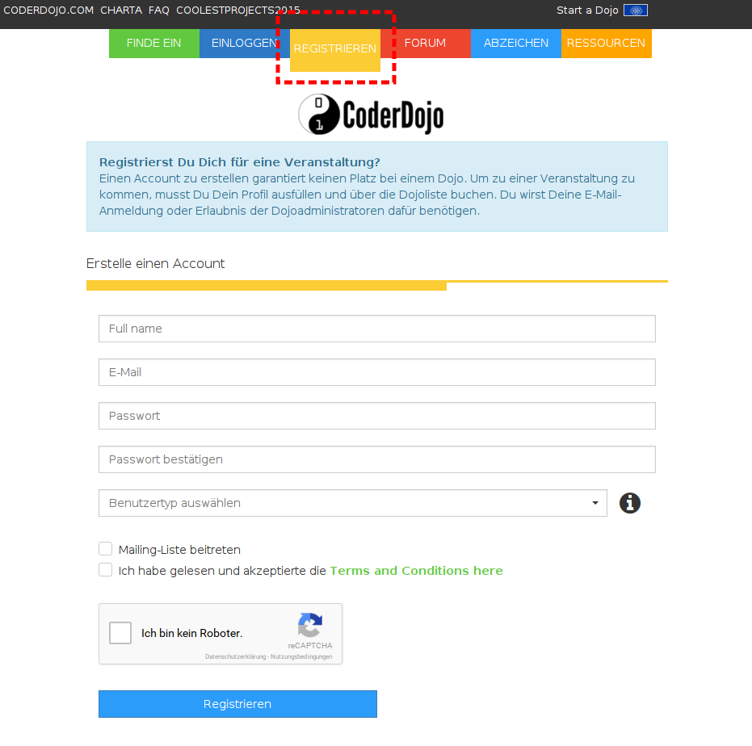
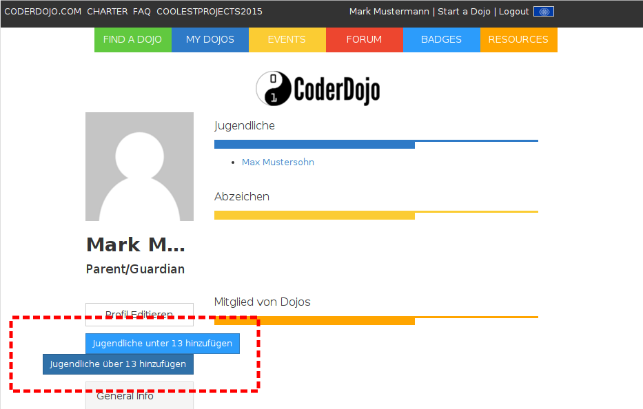
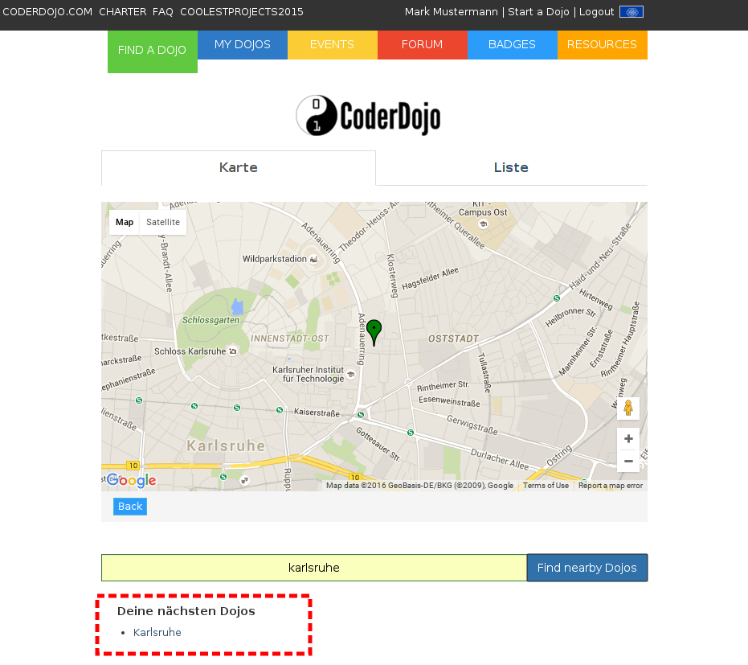
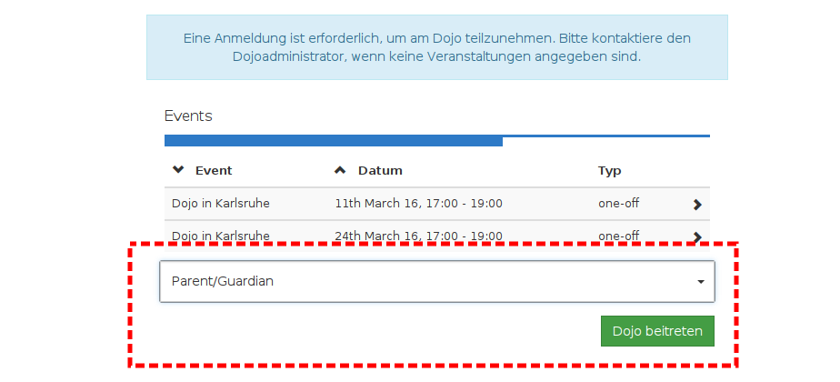
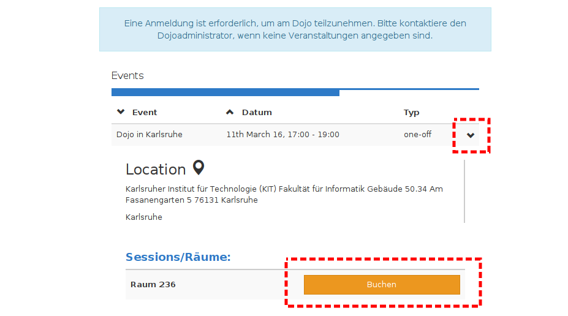
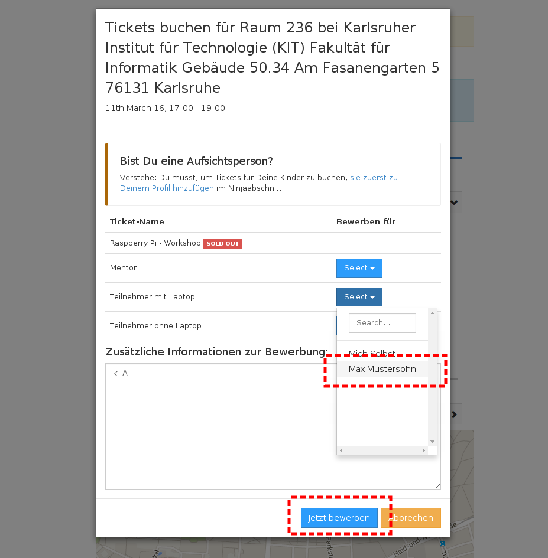
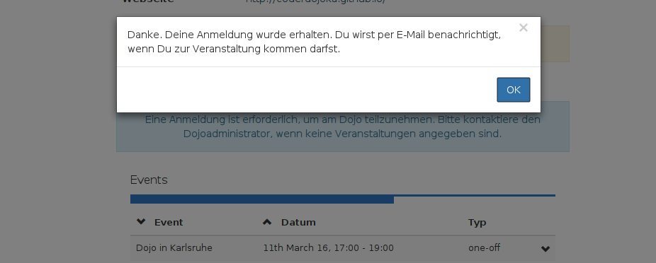

# Anmelden

Um sich selbst oder ein(en) Kind/Jugendlichen zum CoderDojo anzumelden, muss zuerst ein Benutzeraccount angelegt werden.
Gehe dafür auf die Website [zen.coderdojo.com](https://zen.coderdojo.com) und klicke im Menü auf "Registrieren".  

 
 **Hinweis:** Die CoderDojo-Zen Webseite befindet sich immer noch im Aufbau und die Beschriftungen sind teilweise noch auf Englisch und werden im Laufe der Zeit übersetzt/geändert werden.

## Registrieren für Eltern

Kinder, die 12 oder jünger sind, können sich nicht selbst für ein Dojo anmelden. Stattdessen muss ein "Eltern-Account" erstellt werden. Die Felder die für die Registrierung notwendig sind, müssen also aus Sicht eines Elternteils ausgefüllt werden. Als Benutzertyp ist "Parent/Guardian" auszuwählen. Durch Klicken auf den blauen "Registrieren"-Button wird ein Benutzerprofil erstellt.  
Danach muss das Profil noch vervollständigt werden, indem Geburtsdatum, sowie Land und Stadt angegeben und gespeichert werden (blauer "Speichern"-Button). 
Erst im nächsten Schritt, können Kinder/Jugendliche hinzugefügt werden. Dabei können Kinder jedes Alters hinzugefügt werden. Es können also auch ältere Kinder über den "Eltern-Account" angemeldet werden.  

## Registrieren für Jugendliche ab 13 Jahren

Für Jugendliche, die schon 13 oder älter sind, kann ein eigener Account erstellt werden. Dafür müssen die Felder aus Sicht des Jugendlichen ausgfüllt werden und als Benutzertyp "Youth Over 13" ausgewählt werden. Durch Klicken auf den blauen "Registrieren"-Button wird ein Benutzerprofil erstellt. Danach muss das Profil noch vervollständigt werden, indem Geburtsdatum und sowie Land und Stadt angegeben und gespeichert werden (blauer "Speichern"-Button). Der nächste Punkt "Jugendlicher hinzufügen" muss in diesem Fall nicht befolgt werden.

# Einen Jugendlichen hinzufügen (nur für Eltern)

Wenn das Eltern-Profil erfolgreich gespeichert wurde, können Kinder/Jugendliche hinzugefügt werden. Dazu gibt es zwei Knöpfe: "Jugendlicher unter 13" und "Jugendlicher über 13". Durch einen Klick auf den entsprechenden Knopf kann ein Kind hinzugefügt werden. Dazu müssen erneut Name sowie Geburtsdatum, Land und Stadt eingegeben werden.

# Dojo beitreten

Um schneller die jeweiligen Termin für das eigene CoderDojo zu finden, ist es sinnvoll dem Dojo beizutreten. Dazu klickt man im Menü auf "Finde ein Dojo" und sucht im Suchfeld direkt unter der Weltkarte nach Karlsruhe. Die Suchergebnisse werden darunter aufgelistet. Durch Klicken auf Karlsruhe kommt man auf die Seite unseres Dojos. Auf der rechten Seite gibt es weiter unten auf der Seite den grünen Button "Dojo beitreten". Das CoderDojo Karlsruhe ist ab sofort auch über den Menüpunkt "Meine Dojos" zu finden. 

  

# Zu Terminen anmelden

Auf der Seite des Dojos stehen alle aktuellen Termine. Durch Klicken auf den gewünschten Termin, findet man die Option "Buchen" (orangener Button).  

  

In einem Pop-Up-Fenster, muss der Teilnehmer und die Art des Tickets ausgewählt werden. Zusätzlich besteht noch die Möglichkeit eine kurze Nachricht an die Mentoren zu hinterlassen. Durch Klicken auf "Jetzt bewerben" wird die Anmeldung abgeschlossen.  

  

Die Anmeldung muss von uns von Hand bestätigt werden, daher kann es sein, das die Bestätigungsmail nicht sofort kommt, sondern erst einige Stunden später.  

