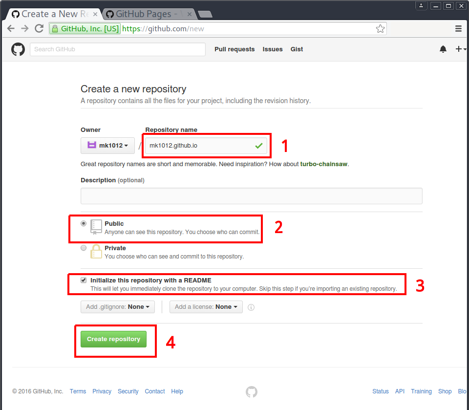
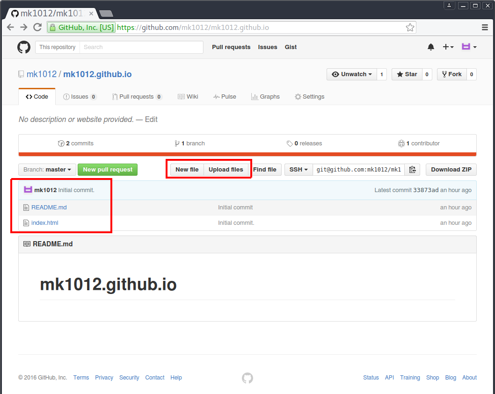
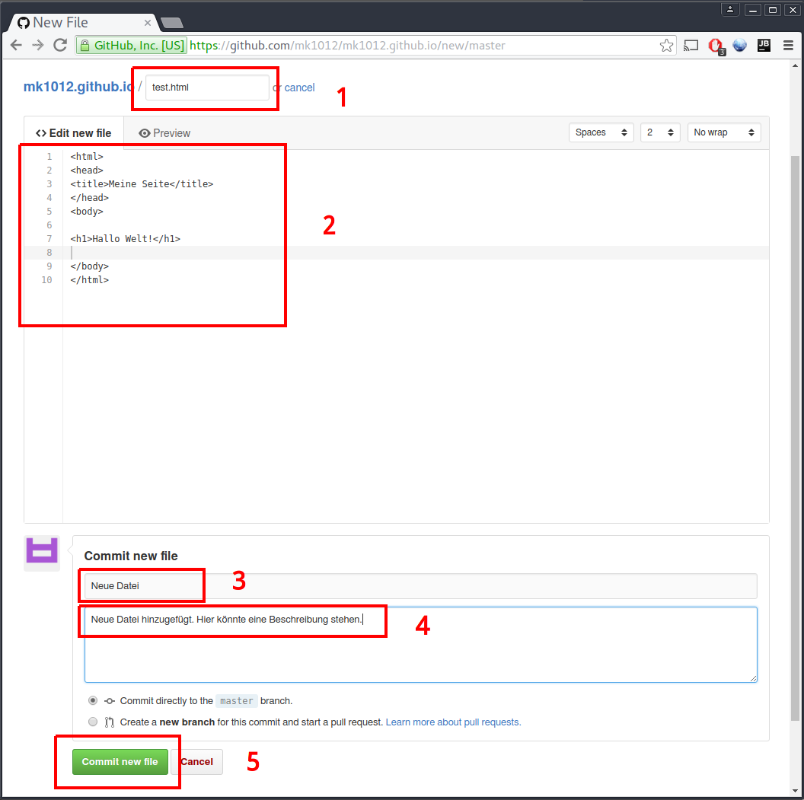
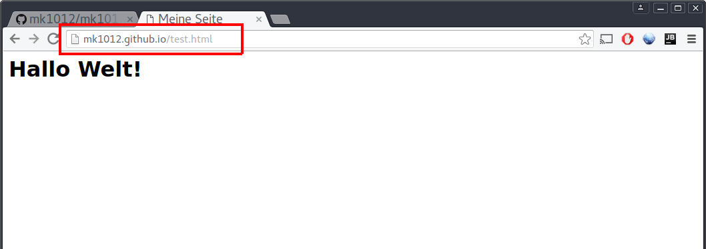

Mit Github Pages, kann man sehr einfach und sehr schnell eine kleine Webseite aufsetzen. Eine Anleitung auf Englisch ist unter: https://pages.github.com/ zu finden. Hier sind die einzelnen Schritte auf Deutsch aufgelistet.

## Vorrauseztungen
- Du hast einen Github-Account. Falls nicht erstelle zuerst einen Github-Account: https://github.com/join
- Du kannst mit Git umgehen, oder hast schon einmal online Github verwendet, um neue Dateien zu erstellen, etc.

## Einrichten deiner persönlichen Githubseite

### Erstelle ein neues Repository
- Wenn du auf der Github registriert und angemeldet bist gehe im Browser auf:  
https://github.com/new
- Erstelle ein neues Repository. Der Name muss dein Benutzername gefolgt von _.github.io_ sein. Mein Benutzername ist _mk1012_, und somit lautet der Repository Name: _mk1012.github.io_. (siehe 1 in Abbildung 1.1)
- Wähle Public als dein Repository-Typ und setze das Häckchen, um eine Readme-Datei anzulegen (2 und 3)
- Klicke auf _Create Repository_ (4), um das Repository anzulegen

### Deine Seite einrichten
Wenn alles geklappt hat solltest du auf deine Repository-Übersicht weitergeleitet worden sein.

- Dort siehst du alle deine Dateien
- Du kannst neue Dateien erstellen oder hochladen

### Online eine neue Datei erstellen
Nach dem Klick auf _New file_ erscheint folgende Seite:

- Dort kannst den Namen festlegen (1)
- Den Inhalt der Datei ändern (2)
- Eine kurze Nachricht verfassen, was du getan hat, mit Titel (3) und optionaler Beschreibung (4)
- Danach auf _Commit new file_ klicken, um die Datei zu erstellen (5)

**Tipp:** Die erste Seite, die im Browser angezeigt wird, wenn du deine Webseite aufrufst hat per Konvention den Namen _index.html_. In meinem Beispiel habe ich allerdings _test.html_ als Namen gewählt.

### Eine Datei über Git hinzufügen
Das wird hier leider nicht erklärt... Frage dafür einfach einen Mentor :)

### Ausprobieren
Hat das Ganze funktionert, sollte deine Seite online verfügbar sein. Tippe dafür in den Browser folgende Addresse ein: _Benutzername_.github.io/test.html ein.
Wobei du _Benutzername_ natürlich durch deinen Benutzernamen und ggf. auch _test.html_ durch den von dir gewählten Dateinamen ersetzt.
In  meinem Fall ergibt sich diese Addresse: http://mk1012.github.io/test.html

