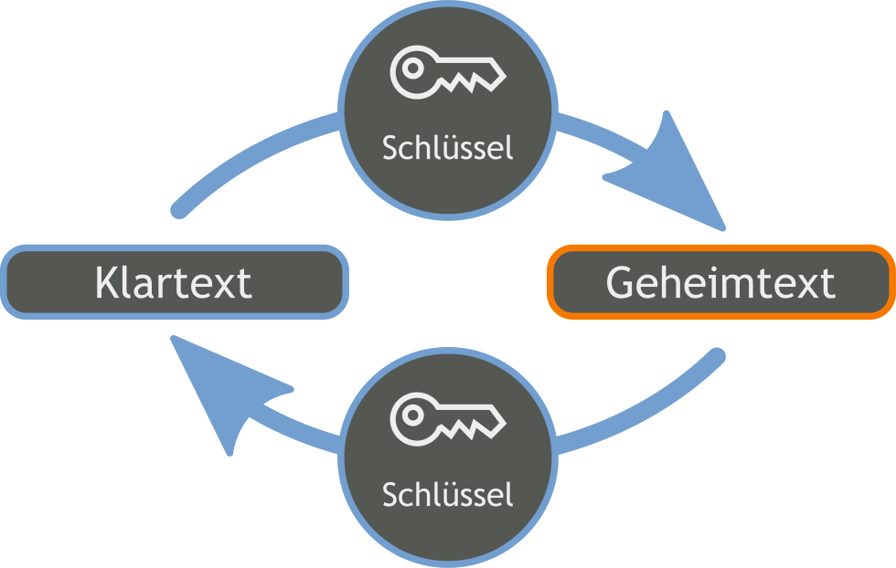

# Verschlüsselung mit Java #

In diesem Projekt geht es darum ein Programm zu bauen, welches:

1. Einen **Text** vom Benutzer als **Eingabe** bekommt.
2. Diesen Text mit einer **Verschlüsselung** unkenntlich macht.
3. Und anschließend den **verschlüsselten Text ausgibt**.

### Was sind Verschlüsselungen? ###

Als Verschlüsselung bezeichnet man ein Verfahren, dass einen **lesbaren Text** (auch **Klartext** genannt) in einen **unverständlichen Text** (auch **Geheimtext** genannt) verwandelt. Wie genau der herauskommende Geheimtext aussieht ist dabei von einem **geheimen Schlüssel** abhängig.

Mit diesem Schlüssel ist es auch möglich einen Geheimtext wieder in den entsprechenden Klartext umzuwandeln. Das funktioniert aber nur, wenn der Klartext zuvor mit **demselben** Schlüssel verschlüsselt wurde. Damit ist es möglich, mit anderen zu kommunizieren, ohne dass es anderen möglich ist die Nachrichten zu lesen.

### Ein einfaches Beispiel: Die Caesar-Verschlüsselung

Bei der Caesar-Verschlüsselung wird jeder Buchstabe des Klartextes um eine bestimmte **Anzahl** an Buchstaben verschoben. Soll zum Beispiel jeder Buchstabe um **3** Stellen verschoben werden, würde jedes *A* durch ein *D* ersetzt werden. Andere Buchstaben würden wie folgt ersetzt werden:

| Nummer         |  1  |  2  |  4  |  5  |  6  |  7  |  8  |  9  |  10  |  11  |  12  |  13  |  14  |  15  |  16  |  17  |  18  |  19  |  20  |  21  |  22  |  23  |  24  |  25  |  26  |  27  |
| :------------: | --- | --- | --- | --- | --- | --- | --- | --- | ---- | ---- | ---- | ---- | ---- | ---- | ---- | ---- | ---- | ---- | ---- | ---- | ---- | ---- | ---- | ---- | ---- | ---- |
| **Klartext**   |  a  |  b  |  c  |  d  |  e  |  f  |  g  |  h  |  i   |  j   |  k   |  l   |  m   |  n   |  o   |  p   |  q   |  r   |  s   |  t   |  u   |  v   |  w   |  x   |  y   |  z   |
| **Geheimtext** |  D  |  E  |  F  |  G  |  H  |  I  |  J  |  K  |  L   |  M   |  N   |  O   |  P   |  Q   |  R   |  S   |  T   |  U   |  V   |  W   |  X   |  Y   |  Z   |  A   |  B   |  C   |

Damit wird aus dem Klartext
> Ich programmiere Java!

der folgende Geheimtext:
> Lfk surjudpplhuh Mdyd!

Hierbei bestimmt die **Anzahl** der verschobenen Buchstaben wie der Geheimtext aussieht. Damit ist die Anzahl der Schlüssel dieser Verschlüsselung. In unserem Beispiel wäre der Schlüssel somit einfach die Zahl **3**.
