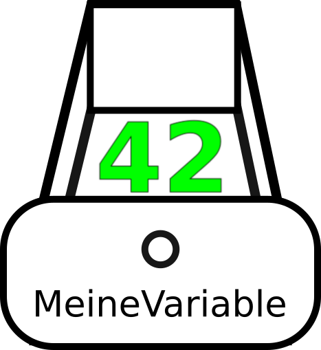

# Grundlagen

## Kommentare

Kommentare gehören nicht zum eigentlichen Programm, sondern sind als Hilfe für den Programmierer gedacht.
```python
# Ein Kommentar, der bis ans Zeilenende geht

""" Ein Kommentar, der
über mehrere Zeilen geht.
"""
```

Variablen
---------
Variablen sind Wertespeicher. Man kann darin einen Wert ablegen und diesen wieder abfragen.
Sie sind wie eine kleine Schublade, die einen Namen hat und einen Wert enthält.
Um einer Variablen einen Wert zuzuweisen, muss sie links von einem `=` -Zeichen stehen.
```python
# Eine neue Variable Zahl mit dem Namen ’meineZahl’ und Wert 42
meineZahl = 42

# Den Wert um 5 erhöhen
meineZahl = meineZahl + 5

# Eine Text-Variable. Texte stehen in "..".
meinText = "Hallo Welt"
```
{w=.4}

Du darfst deinen Variablen beliebige Namen geben, verwende aber am besten sinnvolle Namen. `a1` ist ein schlechter Name, `zaehler` ist ein besserer Name! Mögliche Zeichen sind u.a. Buchstaben und Zahlen, allerdigs keine Umlaute, z.B `ä` oder Leerzeichen.


Ausgabe
-------
Mit der `print(..)`-Funktion kann man Text und/oder Variablen ausgeben.

```python
# Gibt einen Text aus
print("Hallo Welt")

# Gibt den Wert einer Variablen aus
name = "Mark"
print("Hallo")
print(name)

# ’print’ gibt auch mehrere Werte mit Leerzeichen getrennt aus
print("Hallo", name)
```

Rechnen mit Zahlen
-----------
Man kann mit Zahlen und Variablen ganz normal rechnen.
```python
# Mit Zahlen kann ganz normal rechnen
wert = 10 + 20 # = 30
wert = 10 - 20 # = -10
wert = 10 / 2 # = 5
wert = 10 * 2 # = 20
wert = 10 % 3 # = 1, da 10 / 3 = 3 Rest 1
wert = 10 ** 3 # = 1000 = 10 * 10 * 10
```

Eingabe durch den Benutzer
--------------------------

### input - Text einlesen
Die Funktion `input(..)` fordert den Benutzer auf einen Text einzugeben. Die `input(..)`-Funktion wartet solange, bis der Benutzer etwas eingetippt und mit der Enter-Taste bestätigt hat. Die Eingabe wird dann als Text zurückgegeben und in der Variablen `eingabeText` gespeichert.

```python
eingabeText = input("Bitte Text eingeben: ")
print(eingabeText) # gibt den eingelesenen Text aus
```

### input - Eine Zahl einlesen
Will man einen Zahl einlesen, so muss man diese konvertieren! Die `input(..)`-Funktion gibt immer einen Text zurück.  
Eine Zahl, die als Text vorliegt, konvertieren wir mittels `int(..)` in eine ganze Zahl oder mittels `float(..)` in eine Kommazahl:
```python
eingabeText = input("Bitte eine Zahl eingeben: ");

eingabeZahl = int(eingabeText)
# ACHTUNG: wird keine Zahl eingeben, so stürzt das Programm ab!

print(eingabeZahl)
```

# Bedingungen und if-Abfragen

## Bedingung
Eine Bedingung ist entweder Wahr (True) oder Falsch (False).

```python
bedingung = 10 > 20 # False
print("Die Bedingung ist:", bedingung)
```
## Eine Bedingung negieren
Wollen wir einen Bedingung umdrehen (ins Gegenteil kehren ) verwenden wir den `not`-Operator. Dieser macht `True` zu `False` und umgekehrt.

```python
bedingung = 10 > 20 # False
gegenteil = not bedingung
print("Die Bedingung ist nicht:", gegenteil)
```

## if-Abfragen
Eine if-Abfrage überprüft ob eine Bedingung Wahr oder Falsch ist.
Alles was nach dem `if`-Abfrage mit 4 Leerzeichen oder einem Tab eingerückt gehört zum Körper der `if`-Abfrage und wird nur ausgeführt, wenn die Bedingung war ist!

```python
wert = 10 # Eine Variable mit einem beliebigen Wert (hier 10)

if wert > 20: # wird NUR ausgeführt wenn die Bedingung wahr ist
    print("Der Wert ist größer als 20") # (ACHTUNG: Einrückung)

# Hier gehts weiter (ACHUTUNG: Nicht eingerückt)
```

## if-else-Abfragen
Mit einer if-else Abfrage kann man auch auf eine nicht erfüllte Bedingung mit dem ’else’-Zweig reagieren. Es wird immer *entweder* der `if`-Zweig oder der `else`-Zweig ausgeführt.

```python
if wert > 20: # wird NUR ausgeführt wenn die Bedingung erfüllt ist
    print("Der Wert ist größer als 20")

else: # wird NUR ausgeführt wenn die Bedingung nicht erfüllt ist
    print("Wert ist kleiner oder gleich 20.")

# Hier gehts weiter (nicht eingerückt)
```

## Vergleichsoperationen:
Alle Vergleichsoperationen liefern entweder Wahr oder Falsch. Diese können als Bedingung in einer `if`-Abfrage verwendet werden.

### Standardvergleichsoperationen
```python
a = 10
b = 20

a == b # Gleichheit => False
a != b # Ungleichheit => True
a > b  # = False
a >= b # = False
a < b  # = True
a <= b # = True
```

### Überprüfen, ob ein Textstück in einem Text enthalten ist

Mit dem `in` Operator kann man überprüfen, ob ein Textstück in einem Text enthalten ist:

```python
a = "Hallo Welt"

"allo" in a # = True
"oo" in a   # = False
```

### Überprüfung auf None
`None` ist ein Spezialwert, der soviel ausdrückt wie Nichts. Diesen Wert verwendet man als Platzhaltere. Mit dem `is` Operator kann man testen ob eine Variable gleich `None` ist.

```python
a = "Hallo Welt"

a is None # = False
a is not None # = True
```

# Schleifen

## while-Schleife
Eine `while`-Schleife führt den eingerückten Code aus, solange die Bedingung erfüllt ist.
```python

zahl = 1
while zahl < 10: # solange die Bedingung wahr ist...
    # ...wird dieser eingerückte Code wird wiederholt
    print("Zahl:", zahl)
    zahl = zahl + 1 # Zähler erhöhen

# Hier gehts normal weiter (Achtung: nicht eingerückt)
```
**Achtung:** Ist die Bedingung immer wahr läuft das Programm in einer Endlosschleife.

## for-Schleife
Eine `for`-Schleife wird verwendet um eine Liste, Text (ein Text ist nur eine Liste von Buchstaben), o.ä. zu durchzulaufen.
Der eingerückte Code wird für jedes Listenelment einmal ausgeführt.

### Eine Liste durchlaufen:
```python
liste = [1, 2, 3, 4]

for zahl in liste:    
    print("Zahl:", zahl)

# Hier gehts normal weiter (ACHTUNG: nicht eingerückt)
```

### Einen  Text buchstabenweiße durchlaufen:
```python
text = "abcdefghijklmnopqrstuvwxyz"

for buchstabe in text:    
    print("Buchstabe:", buchstabe)

```

## Geschachtelte Schleifen

Bei geschachtelten Schleifen befindet sich eine Schleife innerhalb einer anderen Schleife!
D.h. die innere Schleife und somit der Code innerhalb der inneren Schleife wird mehrmals ausgeführt!  

In diesem Beispiel wird die äußere `for`-Schleife 9 mal ausgeführt.
Die innere `for`-Schleife 4 mal. Der Code in der inneren Schleife wird also:
`9 * 4 = 36` mal ausführt!
```python

for zahlAussen in range(1, 10): # nimmt Werte 1-9 an
    # Achtung Einrückung!

    for zahlInnen in range(1, 5): # nimmt Werte 1-4 an
        # Achtung nochmal einrücken!
        print("Außen:", zahlAussen, "Innen:", zahlInnen)
```
**Hinweis:** `range(untergrenze, obergrenze)` erzeugt eine Liste der Zahlen von der Untergrenze bis zur Obergrenze.
Die Obergrenze ist allerdigs nicht enthalten.

# Text

Ein Text ist im Prinzip nur eine Liste von Buchstaben und Zeichen.
Man kann daher Listenfunktionen wir `len(..)`, den Zugriff auf Element
mittels `text[1]` verwenden oder einen Text Buchstabenweiße mit einer `for`-Schleife durchlaufen. Mehr dazu in der Sektion über Listen.

## Texte kombinieren
Texte kann man mit dem ’+’-Operator aneinander anfügen.

```python
begruessung = "Hallo "
text = begruessung + "Mark" # "Hallo Mark"
print(text)

# Texte kann man auch multiplizieren/wiederholen
text = "Ha" * 3 # HaHaHa
print(text)
```

## Länge eines Texts
Die Funktion `len(..)` ermittelt die Länge von Texten, d.h. die Anzahl an Buchstaben/Zeichen aus denen der Text besteht.

```python
text = "Hallo Welt"
laenge = len(text) # = 10
print(laenge)
```

## Einen einzelnen Buchstaben abfragen
Einen Buchstaben kann man über seine Position im Text abfragen:
```python
text = "Hallo Welt"
buchstabe = text[1]
print(buchstabe) # = 'a'

buchstabe = text[6]
print(buchstabe) # = 'W'
```
**ACHTUNG:** Wir beginnen bei 0 zu zählen, die 1 beschreibt also den zweiten Buchstaben!

## Texte sind unveränderlich
Man kann in einen Text nicht ohne weiteres verändern:
```python
text = "Hallo Welt"
text[1] = "o" # Erzeugt einen Fehler!
```

# Listen
Eine Liste ist ein Container für verschiedene Werte oder Variablen. Du kannst dir einen Liste wie einen Schubladenschrank vorstellen. Die Schubladen sind durchnummeriert und du kannst in jede Schublade einen Wert legen oder daraus lesen.

## Eine Liste erstellen

```python
# Eine leere Liste erstellen
liste = []

# eine Liste mit Einträgen erstellen
liste = [1, 2, 3, 4, 5]
```

## Einen Eintrag aus der Liste lesen

Ein Wert aus der Liste wird über seinen Index, seine Position in der Liste, abgefragt.
```python
liste = ["hallo", "test", "welt"]

ersterEintrag = liste[0] # = "hallo".
```
**Achtung:** Wir beginnen bei 0 zu zählen! Das erste Element hat den Index 0.

## Einen Eintrag von Ende der Liste lesen
```python
# Negative Indices beginnen am Ende zu zählen
letzterEintrag = liste[-1] # = "welt".

print(ersterEintrag, letzterEintrag) # => "Hallo Welt"
```
**Achtung:** wir beginnen hinten bei -1 zu zählen! Das letzte Element hat den Index -1.

## Länge einer Liste ermitteln
```python
liste = [1, 2, 3]

# Die Länge einer Liste (die Anzahl der Elemente) abfragen:
laenge = len(liste) # = 3
print(laenge)
```

## Einen Eintrag hinzufügen
Die `.append(..)`-Funktion fügt einen Eintrag ans Ende der Liste an.
```python
liste = [1, 2]

# einen Eintrag anfügen
liste.append(3)
```

## Eine Liste mit einer `for`-Schleife durchlaufen
Die einzelnen Elemente der Liste werden mittels einer `for`-Schleife durchlaufen.
```python

for element in liste:
    print(element)
```

### Hilfsfunktion für das Ausgeben einer Liste
Gibt die Anzahl der Elemente und deren Werte aus.

```python
def liste_ausgeben(liste):
    print("Liste mit", len(liste), "Einträgen")

    # die Elemente ausgeben
    for element in liste:
        print(element)

# Diese ruft man so auf
liste = [1, 2, "Haus", "Katze"]
liste_ausgeben(liste)
```

## Überprüfen, ob ein Eintrag vorhanden ist

Mittles `x in liste` wird überprüft ob der Wert von `x`, z.B. 1 in der Liste vorhanden ist

```python
liste = [1, 2, "hallo", "welt"]

if 1 in liste:
    print("Enthalten")
else:
    print("Nicht entalten")
```

## Einen Eintrag entfernen
Die `.remove(..)`-Funktion sucht den ersten Eintrag mit diesem Wert und entfernt ihn.
```python

liste = [1, 2, 6]
liste.remove(6) # = [1, 2]

liste_ausgeben(liste)
```
**Achtung:** Hat es keinen solchen Wert, wird ein Fehler erzeugt!

## Zwei Listen kombinieren
Wie bei Texten kann man mit `+` zwei Listen kombinieren.

```python
liste = [1, 2, 3, 4, 5, 6]
liste = liste + [7, 8, 9] # = [1, 2.., 9]

liste_ausgeben(liste)
```

# Funktionen
Eine Funktion ist ein Block Code, der vom Haupt-Programm getrennt definiert wird. Die Funktion wird erst dann ausgeführt, wenn man sie über ihren Namen aufruft. Dafür kann man einen Funktion so oft mal will verwenden. Variablen, die innerhalb einer Funktion definiert sind, sind **nur** innerhalb der Funktion verwendbar!

## Eine einfache Funktion
Funktionen bestehen aus einem Block von eingerückten Code-Zeilen.
Diese werden erst ausgeführt, wenn die Funktion aufgerufen wird.
```python
# Neue Funktion mit dem Namen 'sageHallo' definieren
def sageHallo():
    print("Hallo Welt") # Einrückung!

# Funktion aufrufen (keine Einrückung)
sageHallo()
```

## Funktion mit Übergabeparametern
Funktion können Parameter (Variablen, die nur innerhalb der Funktion existieren) haben.
Diese *müssen* beim Aufrufen mitübergeben werden.
```python
# Funktion definieren
def sageHallo(name, alter):
    print("Hallo", name)
    print("Du bist", alter, "Jahre alt")

# Funktion aufrufen
sageHallo("Mark", 22)
```

## Funktion mit Rückgabewerten
Funktion können einen Wert zurückgeben, müssen aber nicht. Wenn nichts zurückgeben wird,
wird automatisch `None` zurückgeben.
```python
# Funktion definieren
def addiere(zahl1, zahl2):
    summe = zahl1 + zahl2
    return summe

# Funktion aufrufen
ergebnis = addiere(12, 22)
print(ergebnis)
```
# Nützliche Module

## Zufallszahlen
Will man eine Zufallszahl erzeugen, kann man dies mit dem Modul `random` tun.

```python
# das random Modul muss (einmal) importiert werden um die Funktion random.randint() verwenden zu können
import random

# generiert eine Zufallszahl zwischen 1 und 100
zufallsZahl = random.randint(1,100)
print(zufallsZahl)
```
## Aktuelles Datum
Über das Modul `datetime` kann man das aktuelle Datum abfragen.

```python
# Das Paket datetime einmal importieren
import datetime

# aktuelles Datum abfragen
heute = datetime.datetime.now()

jahr = heute.year
monat = heute.month
tag = heute.day
```  

## Die aktuelle Zeit in Sekunden

Du kannst die aktuelle Zeit in Sekunden mithilfe des Moduls `time` ermitteln:

```python
# Das Paket time einmal importieren
import time

# aktuelle Zeit in Sekunden
sekunden = time.time()
```
