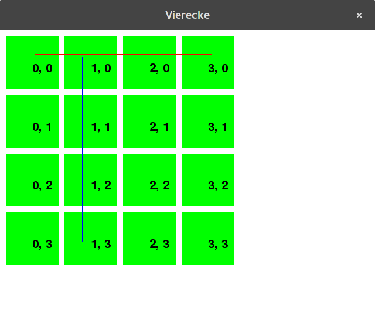

Auf dem Bild sieht man eine rote und einen blaue Spur. Eine Spur ist nur erlaubt, wenn der Start- und Endpunkt in der gleichen Reihe oder Spalte liegen. D.h. eine schiefe Spur ist **nicht** erlaubt.

{w=.8}

Löse das Problem '_ohne_' zu programmieren. Überlege dir wie du das Problem in zwei Teilprobleme aufteilen kannst. Unten sind zwei Diagramme abgebildet, für die beiden Teilprobleme. Fülle in die leeren Felder der beiden Diagramme unten Pseudocode-Schnippsel ein.

# Teilproblem 1:
Du bekommst zwei Zahlen a und b. Gib eine Liste aller Zahlen zwischen und inklusive a und b aus.

{w=.9}

# Teilproblem 2:
Untersuche ob die beien Punkte p und q eine zulässe Spur bilden. Falls ja behandle den horizontalen und vertikalen Fall separat. Gib zum Schluss eine
Liste aller Punkte zwischen und inklusive p und q aus.

{w=.9}
