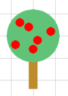

Vorbereitung
============

Um diese Tutorial erfolgreich abzuschließen, muss zuerst pygame und
py2cd installiert sein. Eine Anleitung für Windows ist hier
<https://github.com/coderdojoka/py2cd> zu finden.

Einleitung
==========

Koordinaten-System
------------------

Py2cd ist ein 2D-Zeichenframework und folglich wird ein Objekt durch 2
Koordinaten, eine x- und y-Koordinate, festgelegt. Man kann also durch
einen Punkt die Position eines Objektes bestimmen.

**WICHTIG:** Der Koordinatensystemursprung, also der Punkt `(0|0)` liegt in der linken oberen Ecke.  
Dies ist bei vielen Bildprogrammen wie z.B. Paint oder Gimp genau so.

Fenstergröße
------------

Ein Fenster auf dem Computerbildschirm hat eine bestimmte Größe. Diese Größe wird in Pixeln (px) angegeben. Haben wir bspw. ein Fenster mit der Größe `640x480px`, so sind Objekte, die Koordinaten zwischen `x: 0-640px` und `y: 0-480px` (zumindest
teilweise) sichtbar.

Umgebendes Rechteck
-------------------

In py2cd sind alle Objekte, also z.B. Kreise, Rechtecke, Bilder von einem ’unsichtbaren’ Rechteck umgeben, das das Objekt so genau wie möglich darin einschließt. Dies ist wichtig, da jedes Objekt, auch ein Kreis, so eine Breite und Höhe hat. Diese beiden Werte beziehen sich **IMMER** auf das umgebende Rechteck. Bei manchen Positionsberechnungen und zur Kollisionserkennung wird dieses Rechteck verwendet. Aus diesem Grund können kleine Ungenauigkeiten auftreten.

Ein einfaches Beispiel
======================

Das folgende Beispiel sollte relativ selbst erklärend sein.

``` {.python firstline=3 include=../../../Beispiele/py2cd/erste_schritte.py}
 will be replaced
```

> Bevor gezeichnet werden kann muss zuerst py2cd initialisiert werden mit:
>
> ```
> Spiel.init(640, 480, 'Mein Spiel')
> ```
> Um das Fenster zu starten, muss dieser Code am Ende eingefügt werden:
>
> ``` python
> Spiel.starten()
> ```


Weitere Zeichen-Befehle:
------------------------

Es gibt noch viele weitere Zeichenbefehle und nützliche Funktionen. Hier
noch ein paar weitere aufgezählt.

### Kreise

Kreise können ebenfalls ganz einfach gezeichnet werden:

``` python
# Einen Kreis mit linker Ecke 140x140, einem Radius von 60 px 
k = Kreis(140, 140, 60, MATT_GRUEN)
# Die Mitte des Kreises auf 200x200
setzen k.mitte = (200, 200)
```

Bei Kreisen ist es meistens sehr umständlich diese über die linke obere
Ecke zu positionieren. Deshalb ist es einfacher die Position im nachhinein
mittels `.mitte = (x, y)` zu korrigieren. Auch andere Objekte, wie z.B. Rechtecke
können so positioniert werden.

Bilder
------

Man kann auch eigene Bilder zeichen lassen:

``` python
# Das Bild in den BildSpeicher laden und ihm einen Namen geben: 'scratch' 
BildSpeicher.lade_bild('scratch', 'scratch.png') 
# Das Bild über seinen Namen laden und anzeigen
b = BildSpeicher.gib_bild('scratch')
# Die Position setzen
b.setze_position(50, 20)
```

Bilder muss man über den Bildspeicher laden. Dafür müssen sie zuerst
geladen werden und können danach über ihren Namen abgerufen werden. Die
Postion des Bildes wird nachträglich mit der Funktion `setze_position(x, y)`gesetzt. Diese
Funktion steht auch bei anderen Objekten wie Rechtecken und Kreisen zur
Verfügung.   

**Hinweis:** Das Bild muss im gleichen Ordner wie dein
Programm liegen. Alternativ kannst du auch den Pfad ändern.


Eigene Farben
-------------

Im Zusammenhang mit Computer und Farben spricht man oft von so genannten RGB-Farben.
RGB steht für Rot, Grün, Blau. Eine Farbe wird also aus 3 Komponenten aufgebaut: Einem Rotanteil, Grünanteil und einem Blauanteil. Die R-, G-, B-Werte dürfen dabei Werte zwischen 0 und 255 annehmen. Die Farbe Schwarz entspricht `(0, 0, 0)`, Weiß ist `(255, 255, 255)`. Willst du nun eine eigene Farbe verwenden kannst du dies einfach als 3-Tupel angaben:

``` python
meineFarbe = (255, 0, 0) # Rot voll, Grün und Blau nichts => Rot
r = Rechteck(10, 10, 50, 50, meineFarbe)
```

Eine Farbe wählst du dir am Besten in einem Bildbearbeitungsprogramm wie Paint, Gimp (oder online) aus. Merke dir die RGB-Werte und füge sie in dein Programm ein.

Aufgaben
========

1.  Male einen Apfelbaum, das ganze könnte ungefähr so aussehen:   
    **Hinweis:** Mithilfe des Gitters kannst du die Position der Gegenstände besser ermitteln.

2.  Spiele mit den verschiedenen Funktionen herum. Male dein eigenes Bild! Lade eigene Bilder und verändere ihre Position.
