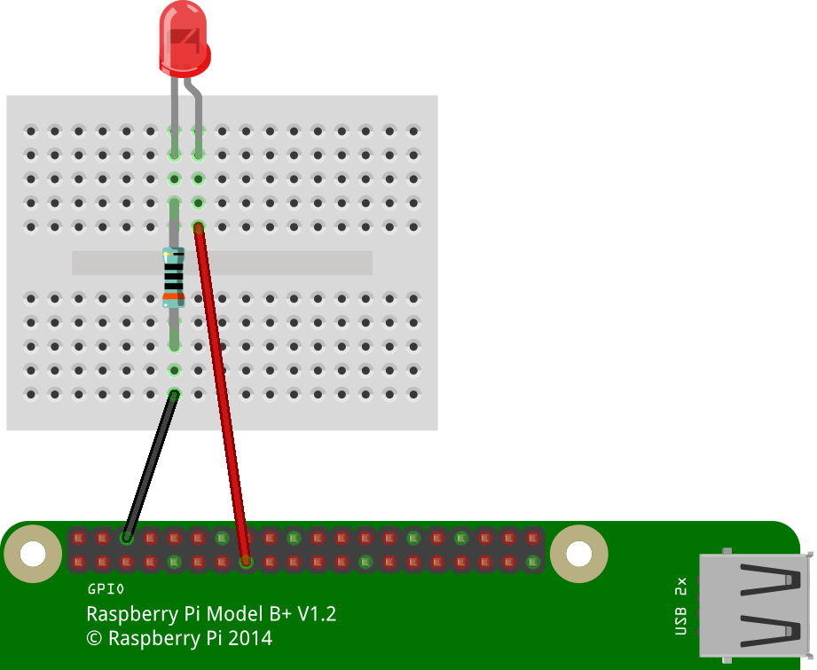
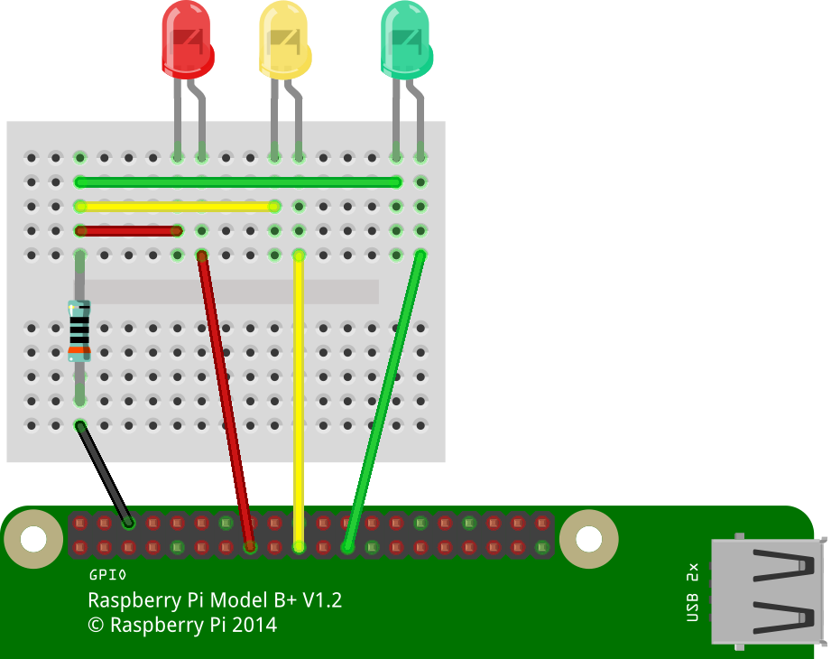

---
autor: Mark  
version: 1.0  
datum: 24.03.16   
titel: Raspberry Pi Workshop I - Schaltung  
--- 

# {magic=minipageStart w=.5}

{w=1.0}

# {magic=minipageNext w=.5}

{w=1.0}

# {magic=minipageEnd}

# {magic=minipageStart w=.5}

{w=1.0}

# {magic=minipageNext w=.5}

{w=1.0}

# {magic=minipageEnd}

