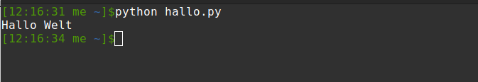
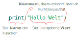

# Lernziele

Du lernst, wie man:

- Variablen erstellt, verwendet und ändert
- Texte und Zahlen verwendet und was die Unterschiede sind
- die Operatoren: `+`, `*`, auf Zahlen und Texte anwendet
- folgende Funktionen verwendet:
  - `print(..)` und `input(..)` zur Ausgabe, bzw. Eingabe
  - `int(..)` und `str(..)` zur Konvertierung in Zahlen, bzw. Texten.

## Ein Python-Programm schreiben. Was ist das und was muss ich beachten?

Ein Pythonprogramm ist im Grunde nur eine Textdatei. Allerdings ist diese in solch einer Weise geschrieben, dass der Computer sie lesen kann und die Anweisungen darin ausführt. Folgende Regeln sind dabei zu beachten:

- Die korrekte Schreibweise ist **SEHR** wichtig
- Eine Anweisung pro Zeile
- Anweisungen werden von oben nach unten ausgeführt
- Die Ausführung einer Zeile kann dauern (z.B. `input(...)` wartet auf Benutzereingabe s.u.). alle weiteren Anweisungen werden  erst nach Abarbeitung der aktuellen Anweisung ausgeführt
- Es gibt auch Kommentare. Diese werden vom Computer einfach ignoriert

## Programm #1 hallo.py:  `Hallo Welt` ausgeben

Erstelle dein erstes Python-Program

```python
print("Hallo Welt")
```

Schreibe obigen Code Zeichen für Zeichen ab. Führe ihn aus, was passiert?

## Analyse Programm #1

Das hallo.py Programm erzeugt die Aussgabe `Hallo Welt` auf der Konsole/Ausgabefenster, je nach dem wo/wie du das Programm ausführst, dass könnte z.B. so aussehen:



In deinem Programm wird die `print`-Funktion aufgerufen. Eine Funktion ist ein Programm-Stück, dass programmiert wurde, um einen bestimmten Zweck zu erfüllen. In unserem Fall gibt die `print`-Funktion den in Klammern übergebenen Wert in der Konsole aus. Funktionen werden aktiviert, indem man sie _"aufruft"_. Erst durch einen Funktionsaufruf wird der Code ausgeführt

In unserem Beipspiel wird der Text `"Hallo Welt"` übergeben. Dieser Text erscheint dementsprechend, wenn das Programm ausgeführt wird.

> **Merkregel Texte und Anführungszeichen**:  
> Alles was in Anführungszeichen steht, ist für den Computer ein Text, auch _"string"_  genannt. Es sind sowohl einfache, als auch doppelte Anführungszeichen erlaubt.  
>
> **Beispiel**: `'Text in einfachen Anführungszeichen'`, bzw. `"Text in doppelten Anführungszeichen"`

**Frage:** Was passiert, wenn man die Anführungszeichen vergisst?

## Einen Funktionsaufruf genauer analysiert

Ein Funktionsaufruf erkennt man im Allgemeinen an den runden Klammern `()` hinter einem Bezeichner wie z.B. `print`. Innerhalb diser Klammern können durch Kommas getrennt mehrere Werte, _Argumente_ genannt, übergeben werden. Es gibt aber auch Funktionen, denen nichts übergeben wird, dann sind die Klammern leer.



Die obige Grafik lässt sich auch gut durch folgende Merkregel zusammenfassen:

> **Merkregel Funktionsaufrufe**  
> Funktionsaufruf setzen sich aus **3 Teilen** zusammen:
> 1. Der Bezeichner/Name der Funktion, hier: `print`
> 2. Die Runden Klammern `(...)`, um die übergebenen Werte
> 3. Die übergebenen Argumente/Werte, hier nur der Wert `"Hallo Welt"`

## Einschub: Kommentare

Dir werden öfters Zeilen über den Weg laufen, die mit einem  `#`-Zeichen beginnen. Diese Zeilen werden vom Computer/Python ignoriert und gehören nicht zum eigentlichen Programm. Sie dienen dazu, den Code mit Notizen/Erklärungen zu versehen! Du solltest dir auch angewöhnen möglichst viele Kommentare in deinen Code zu schreiben, damit du (und andere) später nachvollzeiehen können, was du getan hast.
Beispiel:

```python
# Gibt Hallo Welt auf der Konsole aus
print("Hallo Welt")
```

## Variablen

Als Programmierer sind Variablen deine besten Freunde. Variablen werden
benutzt, um darin Werte zu speichern. Du kannst sie dir wie eine kleine
Schublade vorstellen. Auf der Schublade steht der Name deiner Variablen.


Du kannst die Schublade aufmachen und einen Wert z.B. eine Zahl
reinlegen. Genauso kannst du zu jeder Zeit die Schublade aufmachen, um
den Wert zu lesen.

```python
# eine neue Variable erstellen
zaehler = 42  # Wert schreiben

print(zaehler)  # Wert lesen, gibt 42 aus
```

Auf der linken Seite des `=`-Zeichens steht der Name der Variablen, die erstellt wird.
Auf der rechten Seite steht der Wert, der ihr zugewiesen wird.

> **Merkregel Variablen**  
> Um eine Variable zu erzeugen oder zu verändern verwendet man das `=`-Zeichen (den Zuweisungsoperator).
>
> **Links** des `=`-Zeichens steht die Variable und **rechts** der Wert.
>

Mithilfe des `print()`-Befehls, kann der Wert einer Variablen ausgegeben werden. Ausführlichere Infos gibt es in der Anleitung .

### Anführungszeichen - Wann und wann nicht?

Python erkennt Texte daran, dass sie in Anführungzeichen stehen. Alles was nicht in Anführungszeichen steht muss also eine Variable, Befehl, etc. sein. Deshalb ist es wichtig, Variablen-Namen **nie in Anführungszeichen** zu setzen, da sie sonst als Text interpretiert werden und nicht der Wert der Variablen verwendet wird.

Was ist die Ausgabe dieses Programmes?

```python
variable = "Hallo Welt"
print(variable)
print("variable")
```

## Mit dem Computer schreiben

Es wäre langweilig, wenn du nicht mit Computer, bzw. deinen Programmen interagieren könntest.
Aus diesem Grund gibt es die `input(..)`-Funktion. Führe folgendes Programm aus:

```python
input("Schreib mir etwas: ")
```

Was passiert? Wird etwas ausgegeben? Beendet dein Programm?

Wird das obige Programm ausgeführt, so sorgt der `input(..)`-Befehl, dafür, dass dein Programm wartet,
 bist du etwas schreibst und mit `ENTER` bestätigst. Erst dann wird das Programm weiter ausgeführt.


### Programm #2: echo.py

Funktionen wie `input(..)` haben Rückgabewerte, d.h. sie nehmen nicht nur Werte an, sondern produzieren ggf. auch ein Ergebnis, den so genannten Rückgabewert. Mit dem Rückgabewert kannst du weiter arbeiten, z.B. ihn in einer Variabelen speichern. Was passiert, wenn du dieses Programm ausführst?

```python
deineEingabe = input("Schreib mir etwas: ")
print(deineEingabe)
```

Mehr Infos zu Eingaben und der `input(..)`-Funktion findest du im Tutorial zu  .

## Texte kombinieren
- Plus-Operator/**Kombination** : `+` fügt zwei Text-Stücke zusammen: `text = "Hallo " + "Welt"`
- Mal-Operator/**Wiederholung**: `*` wiederholt den Text: `text = "Ha" * 10`
- Ausprobieren


### Programm #3: wellen.py
- Male mit Hilfe von `print(..)` und den Text-Operatoren ein Meer aus Wellen
- Verwende verschiedene Wellen-Zeichen, z.B: `^` und `~`
- **Beispiel**: So könnte die Ausgabe deines Programms aussehen:
```
~~~~~~~~~~
^^^^^^^^^^
^~^~^~^~^~
~~~~~~~~~~
```
- Wie sieht dein Meer aus? Versuche mit möglichst wenig Zeichen ein möglichst großes Meer zu erzeugen.

---


### Programm #4: werbistdu.py
- Frage den Nutzer mithilfe von `input(..)` nach seinem Namen, Alter, etc.
- Nachdem du die Eingaben eingelsen und in Variablen gespeichert hast, gib sie in einer schönen Form aus, z.B:
```
Hallo Mark!
Du bist 24 Jahre alt.
```

- Frage weitere Dinge ab und gib sie aus.

### Datentypen: Texte `str` und Zahlen `int`
- Python unterscheidet was für einen Datentyp Werte/Variablen haben.
- Neben Texten (in Python `str`, von engl. *string*) z.B. `"abc"` gibt es auch Ganzzahlen, z.B. `234` (in Python `int` von engl. **integer**) oder Kommazahlen ,wie `-123.567` (in Python `float` von engl. *floating point*). Diese benötigen keine Anführungzeichen nur Zahlen mit optinaler Kommastelle `.` und Minuszeichen `-` erlaubt
- Je nach Datentyp, haben Operationen wie `+`und  `*` andere Bedeutung. 

- Versuche die Ausgabe der folgenden Zeilen vorherzusagen (schreibe sie auf ein Blatt Papier), ohne sie auszuführen:
    - `text = "12" + "8"`
    - `zahl = 12 + 8`
    - `text2 = "12" * 2`
    - `zahl2 = 12 * 2`  

   Führe die Zeilen jetzt aus (mit zusätzlichen `print(..)`-Befehlen für die Ausgabe) Was ist die Ausgabe? Waren deine Erwartungen korrekt?
- Die Datentypen müssen zu den verwendeten Operatoren passen, nicht alle Kombinationen sind erlaubt! Beispiel:
- `zahl3 = 12 * "2"`
- Welche Kombinationen von Zahlen und Texten sind möglich, welche davon sind erlaubt (liefern keinen Fehler)

### Anführungszeichen - Wann und wann nicht? Teil II
Was sind folgende Ausdrücke: Variablen oder Werte und welchen Typ haben die Werte?

- `12345`
- `text`
- `"text"`
- `"12345"`
- `text2`
- `-345`
- `"ab23"`
- `234.34`


### Zahlen in Texte umwandeln und umgekehrt
- Neue Funktionen: `int(..)` und `str(..)` 
- `int("1234")` erzeugt aus einem Text, der eine Zahl darstellt einen Zahl
- `str(12345)` erzeugt aus einer Zahl einen Text, der diese Zahl darstellt
- Was passiert, wenn `int(..)` einen Text übergeben wird, der keine gültige Zahl ist?


### Programm #5: zahlensalat.py
- lies 2 zahlen ein
- gib als Zahlen addiert und als string addiert aus
- gib als zahlen multipliziert und als text mit zahl multipliziert aus


---


### Programm #6: wiealt.py
- lies das Geburtsjahr ein
- bereichne mit dem aktuellen Jahr wie alt der Nutzer ist
- Ist das Ergebnis immer richtig? Warum nicht?


### Rechnen mit Python
Python unterstüzt alle Grundrechenarten und noch viel mehr! Grundrechenarten:
- `zahl1 = 22 + 20`
- `zahl2 = 22 - 20`
- `zahl3 = 22 * 20`
- `zahl4 = 22 / 20` 


Kann man diese Operationen auch für Texte verwenden?


Besonderheiten der Division:
- `zahl = 18 / 4`
- `zahl1 = 18 // 4` 
- `zahl2 = 18 % 20`

Was tun diese drei verschiedenen Operationen?

### Programm #7: grundrechenarten.py
- Lies 2 Zahlen ein
- Berechne das Ergebnis der sieben oben aufgeführten Berechnungen und gib jeweils die Rechnung mit Ergebnis aus.


### Programm #8: rechenmeister.py
- Lies 2 Zahlen ein
- Fordere jemand (dich selbst) auf die beiden Zahlen im Kopf zu multiplizeren 
- Lass dir das Ergebnis ausgeben, wenn du `ENTER` drückst (einen beliebigen Text einliest)

### Programm #9 Alle meine Fehler
- Schreibe ein Programm, das abstürzt (einen Fehler erzeugt)
- Wie viele verschiedene Fehlermeldungen kannst du erzeugen?

### Programm #10 Ein eigenes Programm
- Denke dir ein eigenes kleines Programm aus, dass die neuen Befehle verwendet, die du gelernt hast
- 


### Abschluss

- Du solltest 10 Programme erstellt haben, toll!
- Kommentiere alle Programme die du erstellt hast! Schreibe zu jeder (wichtigen) Zeile einen Kommentar-Hinweis, was die entsprechende Zeile bewirkt
- Halte dein Cheat-Sheet aktuell! Hast du alle Befehle und Operationen eingetragen?!


## Du solltest folgende Dinge/Funktionen jetzt kennen (und nie wieder vergessen :)

- Die `print`-Funktion, um etwas auf der Konsole auszugeben
- Die `input`-Funktion, um Texte einzulesen
- Was Texte sind:
    - Woran erkennt man Texte?
- Zahlen:
    - Woran erkennt man Zahlen?
    - Wie unterscheiden sie sich von Texten?
- Variablen:
    - Woran erkennt man Variablen?
    - Wie ändert man den Wert einer Variablen?
    - Wie liest man den Wert einer Variablen
    - Wie unterscheiden sie sich von Texten/Zahlen?
    - Variablen haben verschiedene Typen, je nachdem welchen Wert sie speichern
- Die Operatoren `+`, `*` für Texte und für Zahlen!
    - Was bewirken die Operatoren für Texte und was für Zahlen?
- Die `int(..)`-Funktion, um Texte in Zahlen umzuwandeln
- Die `str(..)`-Funktion, um Zahlen in Texte umzuwandeln
