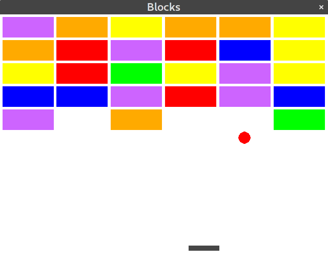




Du willst Spiele in Python entwickeln? Dann bist du hier genau richtig!

## Installation

Eine Anleitung findest unter .
 
## [Befehlsübersicht]({{ "python/pyenguin_referenz.html" | absolute_url }})
Eine Übersicht mit den wichtigsten pyenguin Befehlen kannst hier finden.

## Beispiele

