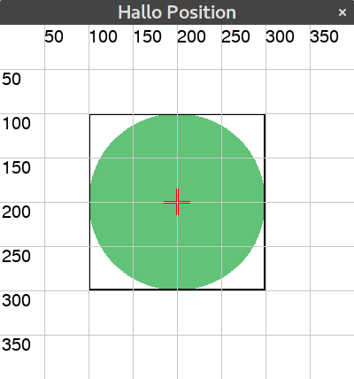

## Grundgerüst
Jedes pyenguin-Program muss folgendes Grundgerüst haben:

``` python
# Importiert alle wichtigen pyenguin Befehle
from pyenguin import *

# Fenster mit Größe und Titel erstellen
fenster = Fenster(640, 480, "Hallo Fenster")

# Dein Code hier

# Das Fenster anzeigen
fenster.starten()

```

> **Hinweis:** Alle folgenden Beispiele benötigen dieses Grundgerüst.
> Oftmals steht es allerdings nicht dabei damit die Beispiele kürzer werden!

## Ein paar einleitende Begriffe

### _Dinge_ oder _zeichenbare Objekte_
Es stehen verschiedene vordefinierte _Dinge_ zur Verfügung, die gezeichnet werden könne, wie Kreise, Rechtecke, etc...
Diese können auf dem Spielfeld platziert werden, wobei sich die Position dieser Objekte immer auf deren **Mitte** bezieht!


### Umgebendes Rechteck

Jedes Objekt von einem unsichtbaren Rechteckt, dem *umgebenden Rechteck* begrenzt. Falls weiter unten sich auf die Breite
oder Höhe von Obejekten bezogen wird, ist dies immer gleichbedeutend mit der Breite/Höhe des umgebenden Rechtecks.

{: .img-50w }
Hier ist der schwarze Rahmen das umgebende Rechteck und das rote Kreuz gibt die Position an.

## Farben
Eine Farbe wird  aus 3 Komponenten aufgebaut: Rot, Grün, Blau.
Die R-, G-, B-Werte dürfen dabei Werte zwischen `0` und `255` annehmen.
Schwarz ist `(0, 0, 0)`, Weiß ist `(255, 255, 255)`.

``` python
# Rot voll, Grün und Blau nichts => Rot
meineFarbe = (255, 0, 0) 
r = Rechteck(10, 10, 50, 50, meineFarbe)
```
**Hinweis**: Einige wichtige Farben sind bereits vordefiniert. 

## Die Zeichen-Fläche
Im Grunde gibt es nur eine Art von Objekten in pyenguin, nämlich Flächen.
Diese Flächen können bemalt werden und Bilder anzeigen.

```python
# Eine leere Fläche der Größe 100x100
f = Flaeche(100, 100)
# Fläche in Blau einfärben
f.fuelle(BLAU)
# Ein Rechteck an der Stelle 10x10 (links oben) mit Größe 50x50
f.rechteck(10, 10, 50, 50, ROT)
# Ein Rechteck an der Stelle 10x10 (links oben) mit Radius 25
f.kreis(10, 10, 25, GELB)
Ein Text an der Stelle 10x10 (links oben)
f.text("Hallo", 10, 70, Schrift(20), HELL_GRUEN)
Ein Linie vom Punkt (75, 10) nach (75, 90)
f.linie(75, 10, 75, 90, ROT)
# Ein Rechteck an der Stelle 15x10 (links oben) mit Radii 20 und 10
f.oval(15, 20, 20, 10, HELL_GRUEN)
Ein Vieleck bestehend aus den angegenen Punkten
f.vieleck([(80, 80), (90, 80), (85, 90)], HELL_ROT)
```

## Vorhandene Objekte

### Rechtecke
Benötigte Werte: `x`, `y` (linke obere Ecke), `breite`,  `hoehe` und `farbe`.

``` python
r1 = Rechteck(270, 200, 100, 100, GELB)
```

### Kreise
Benötigte Werte: `x`, `y` (linke obere Ecke), `radius` und `farbe`.

``` python
k1 = Kreis(390, 110, 70, MATT_GRUEN)
```


### Linie
Benötigte Werte: `start`- und `end`-Punkt, jeweils `x`- und `y`-Koordinate in einem Tupel z.B. `(100, 140)`, `farbe`,  `dicke` (optional).

```python
l1 = Linie((100, 300), (540, 300), ROT, 2)
```

### Ovale
Benötigte Werte: x, y (linke obere Ecke), Breite-Radius, Höhe-Radius und Farbe.

``` python
o1 = Oval(100, 50, 20, 30, GELB)
```

### Text
Benötigte Werte: Der Text. Optional: Schrift und Farbe.

``` python
t1 = Text('Hallo', schrift=Schrift(30, "Arial"), farbe=SCHWARZ)
```

### Vielecke (Polygone)
Benötigte Werte: Liste aller Eckpunkte, jeweils x- und y-Koordinate in einem Tupel z.B. `(100, 140)`.

``` python
ecken_liste = [(190, 242), (195, 238), (200, 242)]
p1 = Vieleck(ecken_liste, BLAU)
```

### Bilder
Bilder werden über den `BilderSpeicher` verwaltet, müssen einmal geladen werden und können dann beliebig oft angezeigt werden.  
Benötigte Werte: Interne Name für das Bild (frei wählbar), der Pfad/Dateiname des Bildes auf dem Computer.

``` python
# Das Bild EINMAL in Speicher laden.
# Das Bild liegt in dem Order 'bilder' und heißt 'scratch.png'
BildSpeicher.lade("scratch", "bilder/scratch.png")

# Das Bild zweimal anzeigen
bild1 = BildSpeicher.gib("scratch")
bild2 = BildSpeicher.gib("scratch")
# Bilder positionieren...
```

### Mitgelieferte Bilder
Mit pyenguin kommmen beriets einige Bilder coole Grafiken und Bilder mit.

### Animationen
Animation sind einfach ein Liste von Bildern, die schnell hintereinander angezeigt werden.

``` python
namen_liste = ['bilder/n1.png', 'bider/n2.png']
a1 = BildAnimation(namen_liste)

# Animation steuern
a1.start() # Animation starten
a1.pause() # Animation pausieren
a1.stop() # Animation stoppen

a1.setze_wiederhole(True) # Animation endlos wiederholen
```

**Hinweis:** Die Bildernamen können ENTWEDER, der interne Name im Bildspeicher (z.B. oben 'scratch') 
ODER der Dateipfad/Dateiname des Bildes sein.


## Objekte bewegen
Sämtliche oben aufgeführten Objekte besitzen die hier genannten Funktionen. Man ruft diese Funktionen über den Namen der Variablen in der das Objekt gespeichert ist auf. Z.B.: `r1.aendere_position(20, 20)`. 

### Position setzen
**Setzt** die Position eines Objektes **auf** einen bestimmten Wert.  
Benötigte Werte: x-, y-Wert.

``` python
r1 = Rechteck(20, 20, 100, 100, GELB)
r1.setze_position(100, 100)
```

### Position ändern
**Ändert** die Position eines Objektes **um** einen bestimmten Wert.
Benötigte Werte: x-, y-Wert

``` python
r1 = Rechteck(20, 20, 100, 100, GELB)
r1.aendere_position(100, 100)
```

### x- und y-Koordinaten direkt setzen
Man kann die x- und y-Koordinaten eines Objektes auch direkt festlegen.

```python
box = Rechteck(10, 10, 50, 50, ROT)

# x- und y-Koordinate festlegen
box.x = 100
box.y = 200
```

### x- und y-Koordinaten abfragen
Man kann die x- und y-Koordinaten eines Objektes ganz einfach abfragen

```python
box = Rechteck(10, 10, 50, 50, ROT)

# x- und y-Koordinate abfragen und ausgeben
print(box.x, box.y)
```


### Abstand zum Rand setzen
Man kann auch direkt den Abstand zum jeweiligen Rand setzen. Dies geht für oben, unten, rechts und links.  
Benötigte Werte: Abstand

``` python
k1 = Kreis(450, 150, 10, ROT)

# Abstand zum linken Rand: 20
k1.abstand_links = 20

# Abstand zum rechten Rand: 30
k1.abstand_rechts = 30

# Abstand zum oberen Rand: 40
k1.abstand_oben = 40

# Abstand zum unteren Rand: 50
k1.abstand_unten = 50
```
**Achtung:** Der Abstand zum Rand geht immer von der dem Rand am nächsten gelegenen Seite aus!
Setzt man zwei konfligierende Anweisungen: `k1.rechts` und `k1.links`, so zählt natürlich nur die zuletzt ausgeführte Anweisung. 

### Abstand zum Rand abfragen
Wie man den Abstand zum Rand setzen kann, kann man ihn auch abfragen.  
Benötigte Werte: Keine
Gibt zurück: Abstand

``` python
k1 = Kreis(450, 150, 10, ROT)

# Abstand zum linken Rand
links = k1.abstand_links

# Abstand zum rechten Rand
rechts = k1.abstand_rechts

# Abstand zum oberen Rand
oben = k1.abstand_oben

# Abstand zum unteren Rand
unten = k1.abstand_unten
```


### Objekte zentrieren
Man kann Objekte auch mittig auf dem Spielfeld darstellen. Entweder nur horizontal, vertikal oder in beide Richtungen zentriert.  
Benötigte Werte: Keine

```python
# Ganz mittig zentrieren
bild.zentriere()

# Nur horizontal zentrieren
bild.zentriere_breite()

# Nur horizontal zentrieren
bild.zentriere_hoehe()
```


## Fenster - Die zentrale Steuerung

### Das Fenster initialisieren
Das `Fenster` muss **IMMER** zuerst initialisiert werden, bevor irgendetwas getan werden kann.
Benötigte Werte: Breite, Höhe, Titel

``` python
fenster = Fenster(640, 480, "Mein Spiel")
```

### Das Fenster anzeigen
Startet das Spiel und zeigt das Fenster an. Anweisungen danach werden **NICHT** ausgeführt:
Benötigte Werte: Keine

``` python
fenster.starten()
```

### Das Fenser beenden
Beendet das Spiel und schließt das Fenster.  
Benötigte Werte: Keine

``` python
fenster.beenden()
```

### Den Fenstertitel setzen
Benötigte Werte: Titel

```python
fenster.setze_fenster_titel("Mein Fenster")
```


### Hilfsgitter einblenden
Zeichnet Gitterlinien und ein Koordinatensystem ein, um die Positionierung von Objekten zu vereinfachen.  
Benötigte Werte: Keine

```python
Spiel.zeichne_gitter()
```
**Hinweis:** das Gitter ist auch nur ein Objekt und kann deshalb von anderen Objekten verdeckt werden.


### Aktualisierungsfunktion
Das Fenster wird kontinuierlich neu gezeichnet (ca. 30mal pro Sekunde). Will man Animationen darstellen oder Figuren bewegen,
kann man die Aktualisierungsfunktion verwenden, die aufgerufen wird, jedes Mal, wenn die Oberfläche neugezeichnet wird.
 
### Neuzeichenrate (Fps) setzen und abfragen

```python
# Zeichenrate abfragen
fps = fenster.fps

# Zeichenrate setzen
fenster.fps = 60
```
  
### Aktualisierungsfunktion setzen

```python

# Diese Funtion wird wiederholt aufgerufen
def aktualisiere(dt):
    print("aktualisiere")

# Aktualisierungsfunktion bekannt machen
registriere_aktualisiere(aktualisiere)
``` 

### Aktualisierungsfunktion entfernen

``` python
entferne_aktualisiere(aktualisiere)
``` 

## Tastatureingaben
Es gibt zwei verschiedene Arten auf Tastatur eingaben zu reagieren.
Beide Arten binden eine Rückruf-Funktion (Callback) an eine bestimmte Taste.
Diese Rückruf-Funktion wird aufgerufen, wenn diese Taste gedrückt bzw. losgelassen wird.

### Wenn eine Taste gedrückt wird
Die Funktion `registriere_taste_unten(taste, rueckruf_funktion)` bindet die gewünschte Taste an die gewünschte Rückruf-Funktion.
Diese Funktion wird **genau einmal** aufgerufen, wenn die Taste nach unten gedrückt wird.

```python
def leer_gedrueckt(taste):
    print("Leertaste gedrückt.")

# Leertaste 'T_LEER', an die Rückruffunktion binden
registriere_taste_unten(T_LEER, leer_gedrueckt)
```
**Hinweis:** Die Rückruffunktion benötigt genau **einen** Übergabeparameter.

### Wenn eine Taste losgelassen wird
Die Funktion `registriere_taste_oben(taste, rueckruf_funktion)` bindet die gewünschte Taste an die gewünschte Rückruf-Funktion.
Diese Funktion wird **genau einmal** aufgerufen, wenn die Taste gedrückt war und losgelassen wird.

```python
def leer_losgelassen(taste):
    print("Leertaste losgelassen.")

# Leertaste 'T_LEER', an die Rückruffunktion binden
registriere_taste_oben(T_LEER, leer_losgelassen)
```
**Hinweis:** Die Rückruffunktion benötigt genau **einen** Übergabeparameter.


## Mausklicks und Bewegung abfragen

### Mauls geklickt TODO

### Maus bewegt TODO