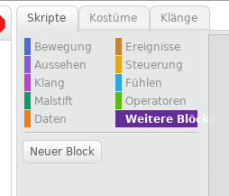
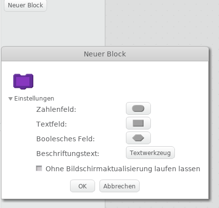
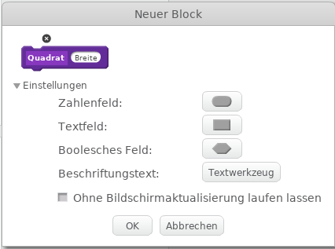
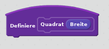
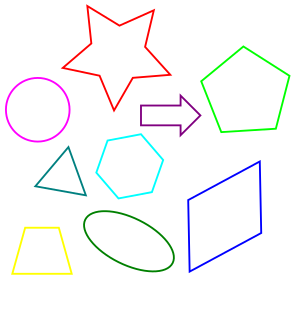


## Eigene Blöcke

Unter dem Punkt „Weitere Blöcke“ können durch klicken auf „Neuer Block“ eigene Scratch Blöcke erstellt werden. 









Unter „Einstellungen“ kann der Block individuell gestalltet werden. 








## Erste Übung: Quadrat

Baue einen ersten Block. Nenne ihn „Quadrat“ und füge ein Zahlenfeld hinzu, das mit „Breite“ beschriftet wird. 









Jetzt gibt es den Block zur Verwendung im mittleren Teil, sowie einen „Definiere“-Block im rechten Programmierbereich.








Unter dem Definiere-Block kann man jetzt die Blöcke zusammenstellen, die immer dann ausgeführt werden, wenn der Block verwendet wird.
Stelle die Blöcke so zusammen, dass mit Hilfe des Malstiftes ein Quadrat der Seitenlänge "Breite" zeichnet.

### Erweiterung 1:

Ergänze den Block um zwei weitere Zahlenfelder: xPosition und yPosition und programmiere den Block so, dass das Quadrat an der entsprechenden Position gezeichnet wird.

### Erweiterung 2:

Außer Quadraten, könnte man auch Rechtecke zeichnen. Welches weitere Zahlenfeld muss dafür noch hinzugefügt werden? Erstelle einen neuen eigenen Block.

## Zweite Übung: Gleichseitiges Dreieck

Erstelle einen weiteren Block, mit dem ein gleichseitiges Dreieck gezeichnet werden kann. Wie sieht ein gleichseitiges Dreieck aus, welche Vorraussetzungen müssen erfüllt sein?

### Erweiterung 3:

Kann man auch Dreiecke mit Verschiedenen Seiten und Winkeln malen? Welche Zahlenfelden müssen dafür hinzugefügt werden?
Denke dir ein paar weitere Dreiecke aus und erstelle eigene Blöcke dazu.


## Weitere Ideen:

Welche weiteren Formen könnte man malen? Erstelle so viele weitere Blöcke für Formen, wie du möchtest. 







