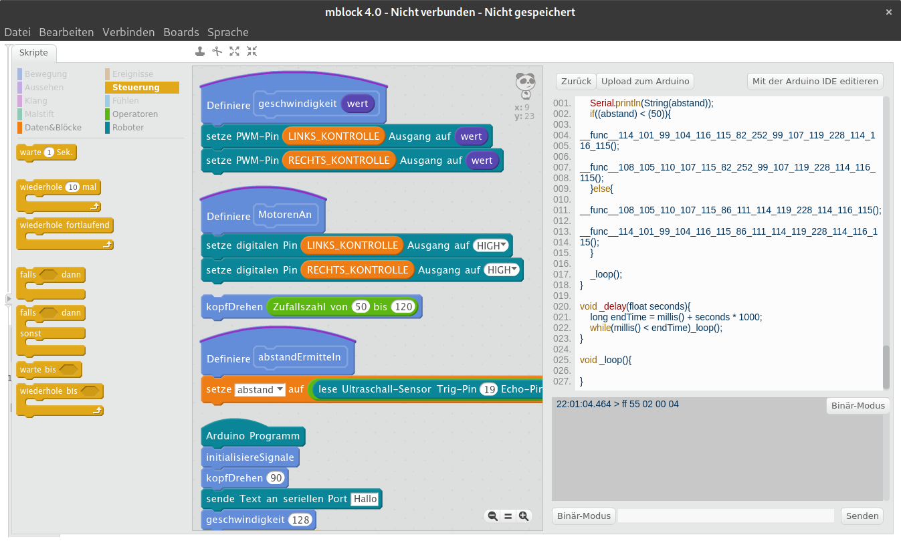

## Download

Wichtig, nicht die neuste Version (mBlock 5) verwenden, sondern mBlock 3 für Windows bzw. mBlock 4 für Linux installieren.
[http://www.mblock.cc/software/](http://www.mblock.cc/software/)

## Verbinden

Unter `Verbinden -> Serieller Port` den richtigen Port auswählen und unter `Boards-> Arduino Uno` auswählen.

## Hochladen

Unter `Bearbeiten -> Arduino Modus` auswählen. Dann auf `Upload zum Arduino` klicken.

## Beispiel Datei

[Hier](smart_car.sb2) ist ein Beispiel Projekt, um die erste Schritte mit deinem Auto zu fahren :)