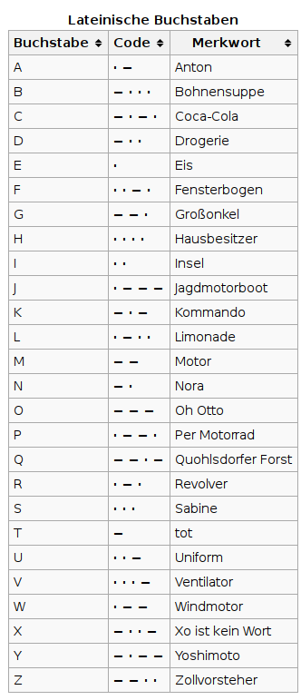

**Hinweis**
Die Raspberry Pis und die verwendeten Komponenten haben/sind empfindliche Bauteile. 
Bitte beachte folgende Regeln:  

- Gehe vorsichtig mit den Raspberry Pis und Bauteilen um. Höre genau zu was dein Mentor sagt. 
- Wenn du dir nicht sicher bist, frage einen Mentor!
- Bevor du deine Schaltung an den Raspberry Pi anschließt, lass deine Schaltung von einem Mentor überprüfen. 

## Vorgehen:
Wir werden in diesem Workshop 3 Schaltung aufbauen und diese über den Raspberry Pi steuern. 
Das Vorgehen ist bei allen Aufgaben gleich:
 
- Zuerst baut jeder die Schaltung auf seinem Steckbrett auf.
- Wenn alle fertig sind und ein Mentor die Schaltung überprüft hat, kann man die Anschlusskabel
an den Raspberry Pi anschließen.
- Danach werden wir ein Programm schrieben, um die Schaltung anzusteuern.

## Erste Schaltung: Temperatur messen

**Bauteile**:  

- 1x Temparatursensor (schwarz, 3 Beinchen)
- 1x Widerstand (blau mit Streifencode: , 2 Beinchen)
- 3x Anschlusskabel (1 Beinchen und ein Plastikstecker)
- 1x Verbindungskabel (2 Beinchen)

 
### Programmieren: Messe die Raumtemparatur
Schreibe ein kleines Python-Programm, dass die Temperatur abfragt und ausgibt.
Berühre den Temparatursensor mit den Fingern und wärme ihn so auf.
Miss die Temparatur erneut und überprüfe ob sich der Wert ändert. Vergleiche dein Ergebnis mit den Anderen in der Gruppe.
 
| Temperaturmessung:            | Dein gemessener Wert: | 
| :---------------------------- | --------------------: |
| im Raum                       |                       |
| mit den Fingern angewärmt     |                       |

 
 
### Langzeitmessung
Während die nächsten Schaltungen aufgebaut werden, wird eine Temparatursensor
weiterhin Messungen anstellen und so die Temparaturänderungen während dem 
CoderDojo aufzeichnen!  
 
| Temperaturmessung:            | Dein gemessener Wert: | 
| :---------------------------- | --------------------: |
| Durchschnittliche Temperatur  |                       |
| Minimale Temperatur           |                       |
| Maximale Temperatur           |                       |

## Zweite Schaltung: Eine LED blinken lassen

**Bauteile**:  

- 1x LED (rot)
- 1x Widerstand (blau mit Streifencode:, 2 Beinchen)
- 2x Anschlusskabel (1 Beinchen und ein Plastikstecker)
 
### Programmieren: Lasse die LED leuchten
Schreibe ein Python-Programm um die LED leuchten zu lassen. Kannst du das Programm so umbauen, dass die LED blinkt?

### Programmieren: Morsezeichen
Früher hat Nachrichten mittels Morsezeichen übertragen. Dabei wird ein Buchstabe durch ein Folge von kurzen (durch einen Punkt dargestellt) und langen (durch einen Strich dargestellt) Signalen kodiert.

Kannst du die LED so blinken lassen, dass ein kurzes Wort, z.B. dein Name geblinkt wird?

## Dritte Schaltung: Drei LEDs leuchten lassen

**Bauteile**:  

- 3x LED (rot, grün, gelb)
- 1x Widerstand (blau mit Streifencode:, 2 Beinchen)
- 4x Anschlusskabel (1 Beinchen und ein Plastikstecker)
- 3x Verbindungskabel (2 Beinchen)

 
### Programmieren: Erstelle eine Ampel
Schreibe ein Python-Programm, so dass die drei LEDs der Reihe nach leuchten, genau wie bei einer Ampel.
In dieser Reihenfolge sollen die LEDs leuchten: Grün, Gelb, Rot, Gelb, Grün, ...

