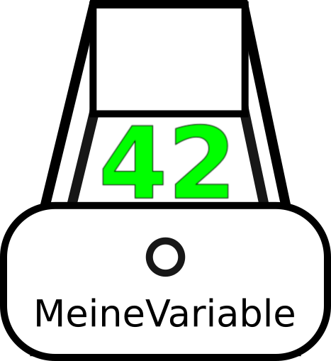

Was sind Variablen
==================

Als Programmierer sind Variablen deine besten Freunde. Variablen werden
benutzt, um darin Werte zu speichern. Du kannst sie dir wie eine kleine
Schublade vorstellen. Auf der Schublade steht der Name deiner Variablen.
Du kannst die Schublade aufmachen und einen Wert z.B. eine Zahl
reinlegen. Genauso kannst du zu jeder Zeit die Schublade aufmachen, um
den Wert zu lesen.



Variablen in Python
-------------------

In Python sieht das Ganze so aus:

``` {.python firstline=1 lastline=4 include=../../../Beispiele/variablen.py}
will be replaced
```

Auf der linken Seite des '='-Zeichens steht der Name der Variablen, die erstellt wird.
Auf der rechten Seite steht der Wert, der ihr zugewiesen wird. Mithilfe
des `print`-Befehls, kann der Wert einer Variablen ausgegeben werden.

``` {.python firstline=7 lastline=8 include=../../../Beispiele/variablen.py}
will be replaced
```

Der Wert der Variablen kann ganz leicht geändert werden.


Rechnen mit Variablen
---------------------

Man kann Zahlen in Variablen speichern, warum also nicht auch mit ihnen
rechnen.

``` {.python firstline=11 lastline=15 include=../../../Beispiele/variablen.py}
will be replaced
```

Hier gibt es zwei neue Variablen: `zahl` und `ergebnis`. Die Variable bekommt als Wert
das Ergebnis der Berechnung von `code * 5` zugewiesen.

``` {.python firstline=16 lastline=21 include=../../../Beispiele/variablen.py}
will be replaced
```

Es können alle Grundoperationen wie Plus, Minus, Mal, Geteilt verwendet
werden. Allerdings sind hierbei Rechenregeln wie ’Punkt vor Strich’ zu
beachten.


Merkregel
---------

> Um eine Variable zu erzeugen oder zu verändern steht die Variable auf der linken
> Seite des ’=’-Zeichens, z.B:
>
> `zahl = 42`
>
>Um den Wert zu lesen steht die Variable auf der rechten Seite des
’=’-Zeichens. Z.B zum Verändern des Wertes einer anderen Variablen:
>
> `ergebnis = zahl + 1`
>


Variablen mit sich selbst verrechnen
------------------------------------

Anfänglich mag es vielleicht etwas verwirrend erscheinen, aber man kann
den Wert einer Variablen überschreiben, indem man den vorherigen Wert in
einer Berechnung verwendet:

``` {.python firstline=23 lastline=26 include=../../../Beispiele/variablen.py}
will be replaced
```

Hier gilt einfach die Merkregel von oben. Zuerst wird die rechte Seite
berechnet. Es wird der Wert von `zahl` gelesen und `1` dazu addiert. Dann wird die Variable auf 
der linken Seite auf den neu ausgerechneten Wert gesetzt.


Aufgaben
========

Damit du mit Variablen vertrauter wirst, spiele einfache ein bisschen mit Variablen herum!

-   Erstelle eine Variable und ändere mehrmals ihren Wert

-   Gib den Wert deiner Variablen mittels `print` aus und sieh wie er sich verändert

-   Überschreibe den Wert deiner Variablen mit 10-fachen des
    ursprünglichen Wertes

-   Finde heraus, welche Buchstaben, Zahlen, Sonderzeichen in Variablen
    erlaubt sind. Um dies auszuprobieren starte mit einem Namen der nur
    Buchstaben enthält, z.B. `zahl`. Starte das Programm, es sollte
    erfolgreich durchlaufen. Füge nun neue Zeichen hinzu und teste
    erneut das Program.


Ausblick
========

Man kann in Variablen natürlich nicht nur Zahlen speichern. Es kann z.B.
auch Text darin gespeichert werden.

``` {.python firstline=28 lastline=31 include=../../../Beispiele/variablen.py}
will be replaced
```

Mehr Infos zum Umgang mit Text
findest du in dem gleichnamigen Tutorial ’Text’.
